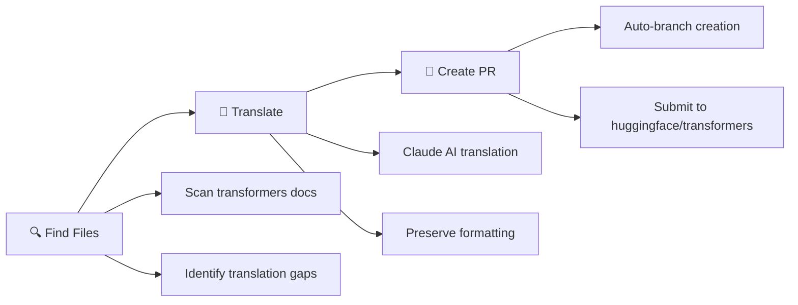

<div align="center">

# 🌐 [i18n-agent] Hugging Face i18n made easy

*AI-powered translation agent for Hugging Face Transformers documentation internationalization*

[](https://huggingface.co/spaces/Agents-MCP-Hackathon/hf-transformers-docs-i18n-agent)
[](https://github.com/topics/agent-demo-track)


**Streamline Hugging Face Transformers documentation translation with Claude AI**   
• **Auto-generate GitHub PRs** • **Multi-language support**

> 🎯 **Created to address [Hugging Face Transformers Issue #20179](https://github.com/huggingface/transformers/issues/20179)** - Making documentation translation more accessible and automated for the global community.

[🚀 Try Live Demo](https://huggingface.co/spaces/Agents-MCP-Hackathon/hf-transformers-docs-i18n-agent) • [📹 Watch Demo](#-demo-video) • [📖 Documentation](#-quick-start)

</div>

---

## ✨ What is this?

Transform the way you contribute to Hugging Face Transformers' global community! This AI agent automatically:

- 🔍 **Discovers** missing translations in [Transformers documentation](https://huggingface.co/docs/transformers/en/index)
- 🤖 **Translates** using Claude Sonnet 4 with technical precision  
- 📝 **Creates** GitHub pull requests ready for review on [huggingface/transformers](https://github.com/huggingface/transformers)
- 💬 **Guides** you through the entire process

> **Perfect for**: Contributors addressing [Issue #20179](https://github.com/huggingface/transformers/issues/20179), documentation maintainers, and international communities wanting to make transformer models accessible worldwide.

## 🎯 Addressing the Community Need

This project was specifically created to solve [Hugging Face Transformers Issue #20179](https://github.com/huggingface/transformers/issues/20179), which highlights the need for better internationalization tooling. Our agent tackles the core challenges mentioned in the issue:

- **🚧 Translation Bottlenecks**: Automates the manual translation process
- **📊 Consistency Issues**: Maintains uniform translation quality within each languages  
- **⚡ Scalability Problems**: Handles batch translations efficiently
- **🤝 Contributor Barriers**: Simplifies the PR creation workflow for translators

## 🎥 Demo Video

[Hugging Face i18n Agent Demo](https://youtu.be/J2MBMNk7la8?si=7867ztaU2nPN0UEo)

*Watch the complete walkthrough: from setup to PR creation in under 5 minutes*

## 🚀 Quick Start


### Option 1: One-Click Demo (Recommended)
[](https://huggingface.co/spaces/YOUR_USERNAME/i18n-agent)

✅ **No setup required!** Just click and start translating.  
✅ **Pre-requisites!** Need `Anthropic API key` and `Github token`.

### Option 2: Run Locally

<details>
<summary>🛠️ Local Installation Guide</summary>

```bash
# Clone the repo
git clone https://github.com/Hugging-Face-KREW/i18n-agent.git
cd i18n-agent

# Install dependencies  
make install
source .venv/bin/activate

# Set up your keys
cp .env.example .env
# Add your Anthropic API key and GitHub token

# Launch the app
python app.py
```

</details>

## 🎯 How It Works

This agent specifically targets the [Hugging Face Transformers documentation](https://huggingface.co/docs/transformers/en/index) and submits PRs addressing [Issue #20179](https://github.com/huggingface/transformers/issues/20179) in the [huggingface/transformers](https://github.com/huggingface/transformers) repository.



### Step 1: 🔍 Discover Translation Targets
- Select your target language (Korean, and more languages will be supported)
- Set how many files to process
- Let AI identify the most impactful Transformers docs translations

### Step 2: 🤖 Smart Translation
- Enter your Anthropic API key
- Claude Sonnet 4 translates with context awareness
- Technical terms and code blocks preserved automatically

### Step 3: 📝 Automated PR Creation  
- Configure GitHub credentials
- System creates properly formatted pull requests for [huggingface/transformers](https://github.com/huggingface/transformers)
- Optional: Use reference PRs for consistency

## 🌍 Supported Languages

<div align="center">

| Language | Code | Status |
|----------|------|--------|
| 🇰🇷 Korean | `ko` | ✅ Fully Supported |

*And more languages coming soon...*

</div>

## 🏗️ Architecture

<div align="center">
    <a href="images/workflow.png" target="_blank">
        
    </a>
</div>

<details>

<summary>📊 System Design Overview</summary>

**Frontend Layer**
- Gradio web interface with modern styling
- Real-time chat & quick controls with AI agent
- Progress tracking missing 

**AI Processing Layer**  
- File discovery with intelligent prioritization for Transformers docs
- Claude Sonnet 4 for context-aware translation
- LangChain integration for PR research

**Integration Layer**
- GitHub API for automated PR creation to [huggingface/transformers](https://github.com/huggingface/transformers)
- Branch management and commit structuring
- Template matching from reference PRs

</details>

## ⚙️ Configuration

### For Spaces Deployment
Prepare these secrets:

```bash
ANTHROPIC_API_KEY=your_claude_api_key
GITHUB_TOKEN=your_github_token  
```

### For Local Development
Create `.env` file:

```bash
ANTHROPIC_API_KEY=<your api key>

# GitHub PR Agent Configuration
GITHUB_TOKEN=<your github token>
GITHUB_OWNER=<your github username>
GITHUB_REPO=<your repository name>
REFERENCE_PR_URL=<reference pr url for style analysis>
```

## 🤝 Contributing

<div align="center">

**Love this project? Here's how you can help:**

[](https://github.com/Hugging-Face-KREW/i18n-agent.git)
[](https://github.com/Hugging-Face-KREW/i18n-agent.git)
[](https://github.com/Hugging-Face-KREW/i18n-agent.git)

</div>

### 👥 Contributors

🤗 shhr.kre@gmail.com / @harheem  
🤗 jminj6@gmail.com / @Jwaminju

## 💡 Use Cases

> **🌟 Real-world scenarios where this agent shines:**

- **📚 Documentation Teams**: Batch translate Transformers documentation updates
- **🌍 Community Contributors**: Help make Transformers accessible in your language  
- **🏢 Organizations**: Streamline i18n workflows for Transformers library
- **👨‍💻 Developers**: Contribute Transformers translations without manual GitHub workflow
- **🎯 Issue #20179 Contributors**: Directly address the internationalization challenges raised by the community

## 🛠️ Tech Stack

<div align="center">


</div>

## ❓ FAQ

<details>
<summary><strong>Q: How does this relate to Issue #20179?</strong></summary>
<br>
This agent directly addresses the pain points raised in <a href="https://github.com/huggingface/transformers/issues/20179">Issue #20179</a> by automating the translation workflow, reducing manual overhead, and making it easier for contributors to submit high-quality translations.
</details>

<details>
<summary><strong>Q: How accurate are the translations?</strong></summary>
<br>
The agent uses Claude Sonnet 4, which provides high-quality translations with technical context awareness. It preserves code blocks, maintains formatting, and follows established translation patterns.
</details>

<details>
<summary><strong>Q: What permissions do I need for GitHub integration?</strong></summary>
<br>
Your GitHub token needs repository read/write permissions and the ability to create branches and pull requests on the target repository.
</details>

<details>
<summary><strong>Q: Can I customize the translation style?</strong></summary>
<br>
Yes! You can provide reference PR URLs to match existing translation patterns and maintain consistency with community standards.
</details>

## 🐛 Troubleshooting

### Common Issues

<details>
<summary><strong>API Key Issues</strong></summary>

- Ensure your Anthropic API key is valid and has sufficient credits  
- Check that your GitHub token has the necessary repository permissions  

</details>

<details>
<summary><strong>Translation Quality</strong></summary>

- The system uses Claude Sonnet 4 for high-quality translations  
- Formatting and markdown structure is maintained  
- Please restart the translation again if you met format issue

</details>

<details>
<summary><strong>GitHub PR Creation</strong></summary>

- Verify repository permissions and branch protection rules  
- Check that the reference PR URL is accessible and valid  

</details>


## 🙏 Acknowledgments

Special thanks to the amazing communities that make this possible:

- **🤗 Hugging Face** - For building the Transformers library and comprehensive documentation
- **🎭 Anthropic** - For Claude's incredible language capabilities  
- **👥 Hugging Face KREW Community** - For championing Korean AI translation
- **🎨 Gradio** - For making beautiful AI interfaces simple
- **🌍 Community Contributors** - For raising awareness through [Issue #20179](https://github.com/huggingface/transformers/issues/20179)

---

<div align="center">

**Made with ❤️ for global accessibility of Hugging Face Transformers documentation.**

**🎯 Solving [Issue #20179](https://github.com/huggingface/transformers/issues/20179) one translation at a time.**

[⭐ Star this repo](https://github.com/Hugging-Face-KREW/i18n-agent.git) • [🐛 Report Bug](https://github.com/Hugging-Face-KREW/i18n-agent.git) • [💡 Request Feature](https://github.com/Hugging-Face-KREW/i18n-agent.git)

</div>
